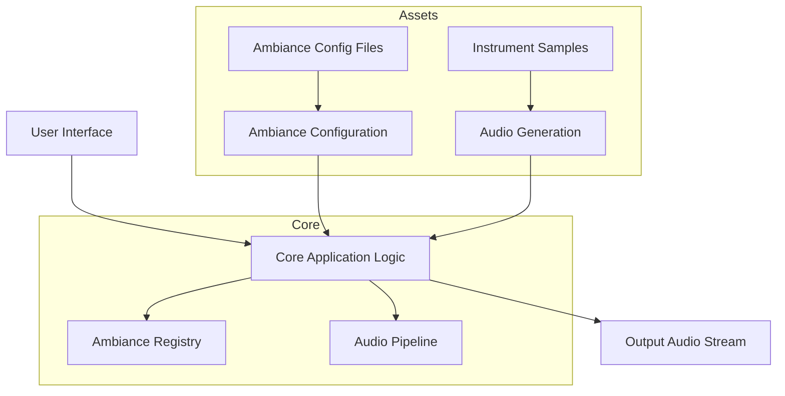

# Musical Loop Generation Application - Project Structure

## Directory Hierarchy
```
musical-loop-generator/
├── src/                # Source code
│   ├── core/            # Core application logic
│   ├── audio/           # Audio generation engine
│   ├── ambiance/        # Ambiance configuration modules
│   └── ui/              # User interface components
├── assets/             # Static assets
│   ├── audio_samples/   # Pre-recorded instrument samples
│   └── ambiance_configs/ # Ambiance-specific configuration files
├── config/             # Global configuration
├── docs/               # Documentation
├── tests/              # Test suites
└── README.md           # Project overview
```

## Module Architecture


### Core Module
- **Application Controller**: Central state management and coordination
- **Ambiance Registry**: Loads and manages available ambiance configurations
- **Audio Pipeline**: Coordinates audio generation and effect processing

### Audio Module
- **Sample Loader**: Loads and manages instrument samples
- **Effect Processor**: Applies effects (reverb, delay, filters)
- **Synthesis Engine**: Generates audio loops based on patterns

### Ambiance Module
- **Config Parser**: Reads ambiance configuration files
- **Pattern Generator**: Creates instrument patterns based on ambiance type
- **Effect Chain Manager**: Applies effects in specified order

### UI Module
- **Ambiance Selector**: Allows user to choose ambiance type
- **Parameter Editor**: Enables manual adjustment of audio parameters
- **Visualizer**: Displays audio waveform/visual feedback

## Module Relationships
1. **UI → Core**: User input triggers ambiance changes
2. **Core → Ambiance**: Requests configuration data for selected ambiance
3. **Core → Audio**: Instructs audio engine to generate loop with specific parameters
4. **Ambiance → Assets**: Retrieves ambiance-specific configuration
5. **Audio → Assets**: Loads required instrument samples
6. **Audio → Output**: Streams generated audio to output

## Naming Conventions
1. **Ambiance Types**: Snake_case with descriptive names
   - `mysterious_forest.json`
   - `cyberpunk_rain.json`
   - `sports_fans_chanting.json`

2. **Audio Samples**: 
   - `[ambiance]_[instrument]_[variation].wav`
   - `forest_birds_01.wav`
   - `rain_synthetic_pad_03.wav`

3. **Configuration Files**:
   - `ambiance/[type].config.json`
   - `instruments/[name].preset.json`

4. **Code Files**:
   - `src/ambiance/[type]_processor.ts`
   - `src/audio/[instrument]_handler.ts`

## Extensibility Patterns
### Adding New Ambiances
1. Create config file in `assets/ambiance_configs/[type].config.json`
2. Add instrument samples to `assets/audio_samples/[type]_*`
3. Create ambiance processor in `src/ambiance/[type]_processor.ts`
4. Register in `src/core/ambiance_registry.ts`

### Adding New Instruments
1. Create instrument preset in `assets/instruments/[name].preset.json`
2. Add samples to `assets/audio_samples/[name]_*`
3. Create instrument handler in `src/audio/[name]_handler.ts`

## Configuration Strategy
Each ambiance config file defines:
```json
{
  "tempo": 72,
  "instruments": [
    {
      "name": "forest_birds",
      "volume": -6,
      "effects": ["reverb", "delay"],
      "pattern": "random_interval"
    }
  ],
  "effects_chain": ["reverb", "low_pass_filter"]
}
```

## Documentation Structure
1. `docs/development.md` - Developer setup guide
2. `docs/ambiance_creation.md` - Creating new ambiances
3. `docs/api.md` - Internal API documentation
4. `docs/user_guide.md` - End-user instructions

## System Architecture Diagram
```mermaid
graph TD
    UI[(User Interface)]
    Core[(Core Logic)]
    Audio[(Audio Engine)]
    Assets[(Asset Storage)]
    
    UI -->|Selects ambiance| Core
    Core -->|Requests config| Assets
    Core -->|Triggers audio| Audio
    Audio -->|Loads samples| Assets
    Audio -->|Outputs| [Audio Device]
    
    subgraph Core
        AR[Ambiance Registry]
        AP[Audio Pipeline]
    end
    
    subgraph Audio
        SL[Sample Loader]
        EP[Effect Processor]
    end
    
    AR -->|Provides config| AP
    AP -->|Controls| SL
    SL -->|Plays| EP