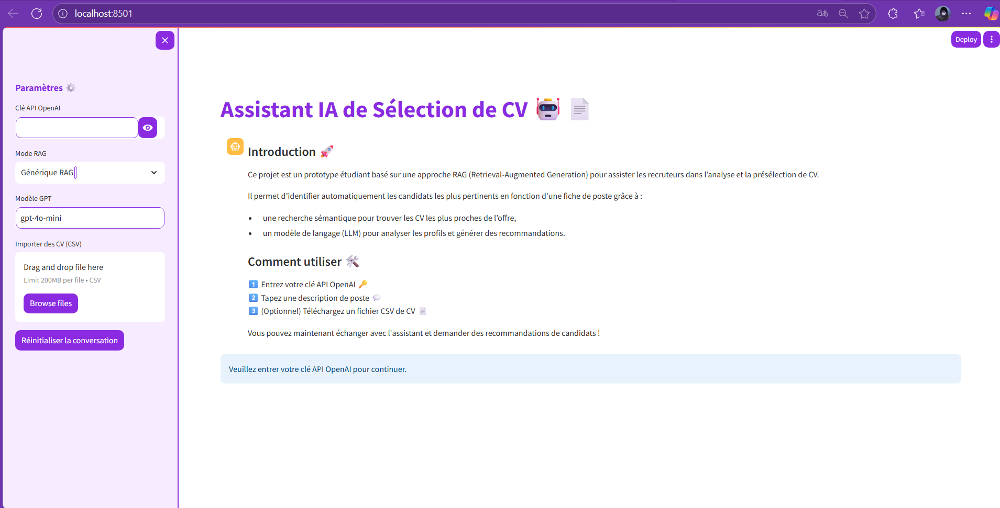
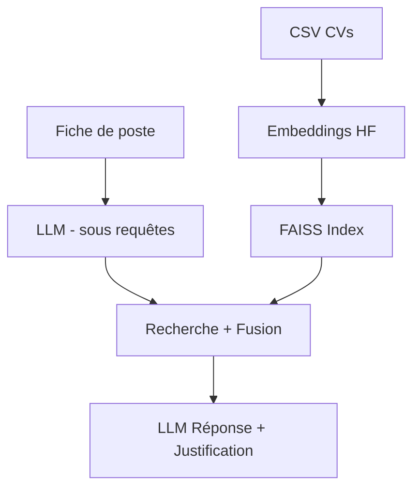
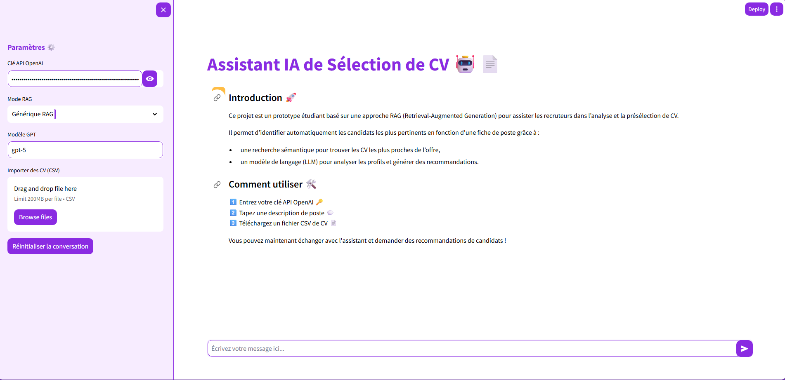
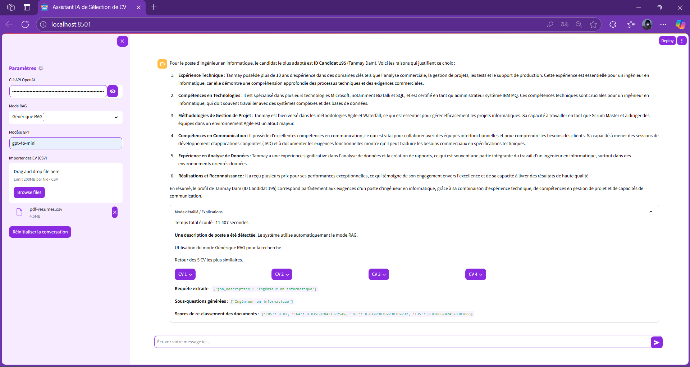
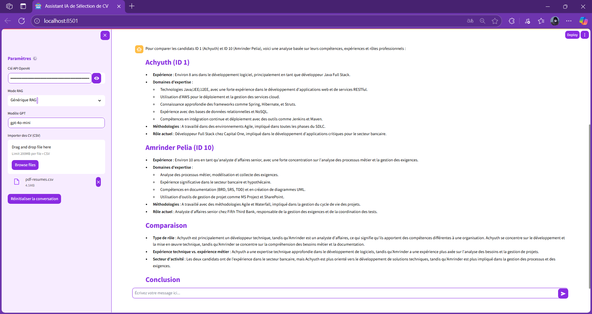

# 🤖 Agent IA de Recrutement – Projet RAG & LLM

<p align="center">
  
</p>

## 📚 Contexte académique

Projet réalisé dans le cadre du module  
**GénAI – Intelligence Artificielle Générative**  
**EPF Paris-Cachan — Promotion 2025**

---

## 👥 Équipe – Groupe 6

| Membres |
|--------|
| Lamyae TALA |
| Marilson SOUZA |
| Brenda KOUNDJO |

---

## 🎯 Objectif

Développer un **assistant intelligent de recrutement** capable de :

- Lire une fiche de poste 💼  
- Extraire les compétences clés 🧠  
- Comparer automatiquement plusieurs CV 📄  
- Identifier les meilleurs profils ✅  
- Expliquer ses choix 🔍

Ce projet implémente une approche **RAG (Retrieval-Augmented Generation)** combinée à un **LLM** pour booster la présélection des candidats.

---

## ✨ Fonctionnalités

| Fonction | Description |
|--------|------------|
📎 Upload CSV | Liste de CV à analyser  
🔍 Recherche sémantique | Embeddings + FAISS  
🧠 RAG + RAG-Fusion | Génération de sous-requêtes  
💬 Chat IA | Interaction avec le recruteur  
📊 Classement | + Justification détaillée  

---

## 🧠 Logique IA & Approche RAG

Ce projet utilise une architecture **RAG avancée** permettant au modèle LLM d’être augmenté par le contenu réel des CVs.

| Étape | Description |
|---|---|
Classification de question | Le modèle décide si une requête active le RAG ou non  
Chunking + Embeddings | Les CV sont découpés et vectorisés (HuggingFace)  
Index FAISS | Recherche vectorielle des CVs les plus pertinents  
RAG Fusion | Génération de sous-requêtes → fusion → reranking  
Reconstruction | Passage des documents complets au modèle  
Réponse finale | Classement + justification textuelle claire  

✅ Réduction des hallucinations  
✅ Meilleure précision contextuelle  
✅ Justification transparente pour le recruteur  

---

## 📊 Évaluation

Métriques utilisées : Answer Similarity, Context Precision, Context Recall, Faithfulness.

### Résultats visuels

<p align="center"></p>
<p align="center"></p>
<p align="center"></p>
<p align="center"></p>

---

## 🏗️ Architecture du système

### Pipeline RAG



---

## 🛠️ Stack Technique

| Composant | Technologie |
|---|---|
LLM | OpenAI GPT  
Embeddings | HuggingFace  
RAG Framework | LangChain  
Vector Store | FAISS  
Interface | Streamlit  
Données | CSV + Pandas  

---

## 📦 Installation

### 1️⃣ Cloner le projet

```bash
git clone <URL_DU_REPO>
cd projet6_TALA_SOUZA_KOUNDJO
```

### 2️⃣ Créer un environnement Python 3.10 et installer les dépendances

```bash
python3.10 -m venv venv
venv\Scripts\activate      # Windows
source venv/bin/activate   # Mac/Linux

pip install -r requirements.txt
```

---

## 🚀 Lancer l'application

```bash
streamlit run demo/interface.py
```

L’interface web s'ouvre dans votre navigateur.

---

## 🖼️ Aperçu Interface

### Écran de démarrage
<p align="center">
  
</p>

### Exemple — Analyse à partir d'une fiche de poste  
<p align="center">
  
</p>

### Exemple — Analyse par IDs candidats  
<p align="center">
  
</p>

---

## 📂 Format CSV attendu

| ID | Resume |
|---|---|
| 101 | "Ingénieur Data, 3 ans d’expérience…" |
| 102 | "Développeur IA, NLP, Python…" |

> ⚠️ Le fichier doit obligatoirement contenir les colonnes **ID** et **Resume**

---

## ✅ Résultats attendus

- 🔝 Sélection des CV les plus pertinents  
- 📊 Classement des candidats  
- 🧾 Justification argumentée  
- 💬 Interface d’échange pour ajustement du besoin  

